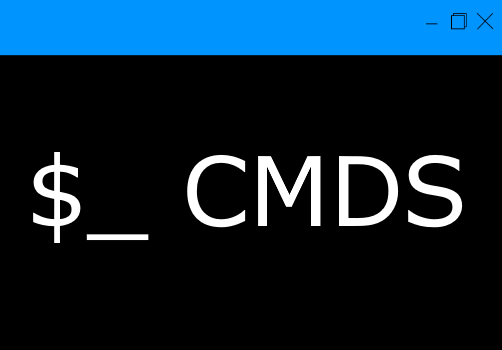
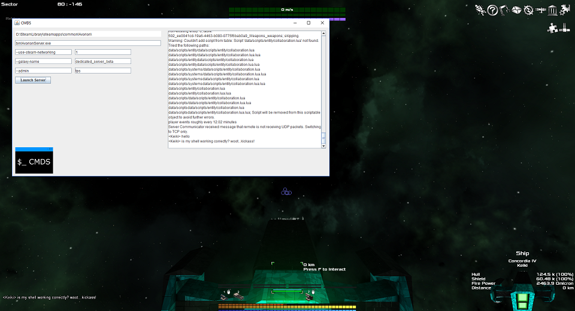
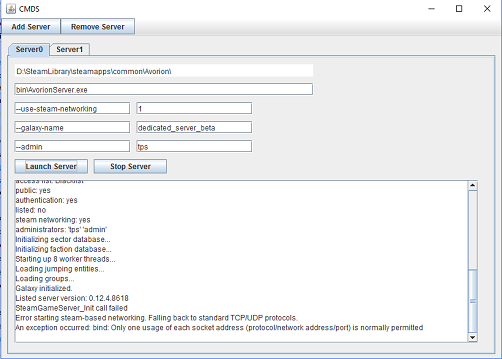
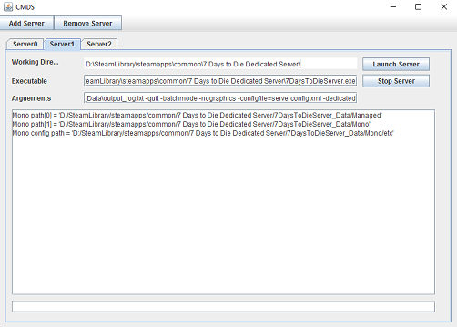

## What is CMDS?
CMDS is **C**ontrol and **M**onitoring of **D**edicated **S**ervers. CMDS will control numerous command line dedicated servers within one GUI.

More information coming soon!

## Roadmap
* [x] Prototype
* [ ] Single Dedicated Server
* [ ] Multiple Dedicated Servers
* [ ] Server Shortcuts
* [ ] Custom Batch File Integration
* [ ] Automatic Update

## ChangeLog
* 1.04 - Added Relative Path option to executable. Added more groundwork for load from file.
* 1.03 - Added Communication to sub processes. Added groundwork for load from file.
* 1.02 - Modularized code. Added tabbedpane.
* 1.01 - Implemented process builder
* 1.00 - Initial prototype

## Images

Working prototype of parameters being passed to a process builder, setting the working directory and executable. Textfield is updated in realtime for server running in background.

Modularized the code to allow for multiple servers to be handled via a tabbed pane.

Beginning to add communication to running dedicated servers, changed layout.

